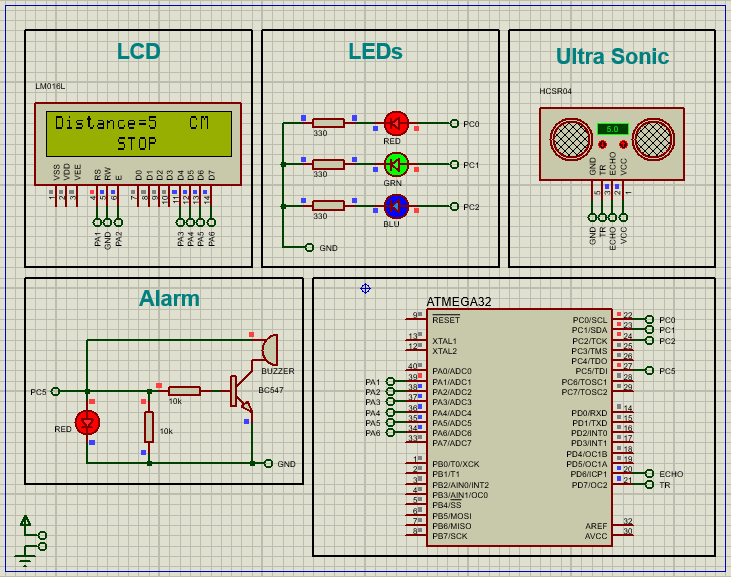

# Car Parking Sensor Using ATmega32, Ultrasonic Sensor, LCD Display, LEDs, and Buzzer

## Project Overview
This project is a car parking sensor system that helps drivers detect obstacles and avoid collisions while parking. The system uses an ultrasonic sensor to measure the distance between the car and an obstacle, displaying this distance on an LCD screen. LEDs and a buzzer provide visual and auditory warnings based on the proximity of the object, ensuring safe parking.

## Objective
The aim of this project is to create a simple car parking sensor that:
- Measures distance using an ultrasonic sensor.
- Displays the distance on an LCD.
- Uses LEDs and a buzzer for proximity warnings.

## Features
- **Ultrasonic Distance Measurement**: Measures the distance to obstacles.
- **LCD Display**: Shows the distance in centimeters and a "Stop" message if the distance is less than 5 cm.
- **LED Indicators**: Red, Green, and Blue LEDs provide visual cues for proximity.
- **Buzzer Alert**: Sounds when the object is too close (<= 5 cm).
- **Dynamic LED Behavior**: LEDs turn on/off based on distance ranges.

## Components
- **Microcontroller**: ATmega32
- **Ultrasonic Sensor**: HC-SR04
- **LCD**: 16x2, 4-bit mode
- **LEDs**: Red, Green, Blue
- **Buzzer**

## Pin Connections
### ATmega32
- **Port A (PA1-PA6)**: Connected to LCD
- **Port B (PC0-PC2)**: LEDs
- **Port C (PC5)**: Buzzer
- **Port D (PD6, PD7)**: Ultrasonic Sensor (Echo, Trigger)

### Ultrasonic Sensor
- **Echo**: PD6
- **Trigger**: PD7

### LEDs
- **Red LED**: PC0
- **Green LED**: PC1
- **Blue LED**: PC2

### Buzzer
- **Pin**: PC5

## System Operation
1. The ultrasonic sensor sends a pulse and measures the reflection time.
2. The ATmega32 calculates the distance based on the reflection time.
3. The LCD displays the distance in cm.
4. LEDs and buzzer respond based on the distance:
   - **<= 5 cm**: All LEDs flash, buzzer sounds, LCD shows "Stop".
   - **6-10 cm**: All LEDs on, no buzzer.
   - **11-15 cm**: Red and Green LEDs on.
   - **16-20 cm**: Red LED on.
   - **> 20 cm**: All LEDs and buzzer off.

## Drivers Requirements
### GPIO Driver

### ICU Driver
- Frequency set to F_CPU/8.
- Configured to detect the rising edge.

### Buzzer Driver
- **Buzzer_init**: Initializes and turns off the buzzer.
- **Buzzer_on**: Activates the buzzer.
- **Buzzer_off**: Deactivates the buzzer.

### LCD Driver
- Used the 4-bit mode LCD driver.
- Displays distance and "Stop" message as needed.

### Ultrasonic Driver
- **Ultrasonic_init**: Sets up the ICU and trigger pin.
- **Ultrasonic_Trigger**: Sends a pulse.
- **Ultrasonic_readDistance**: Measures and returns distance.
- **Ultrasonic_edgeProcessing**: Callback to handle ICU events.

## Video Reference
[Car Parking Sensor Video](https://youtu.be/bhtyP1ZBiJg)

Happy Coding ❤️.
